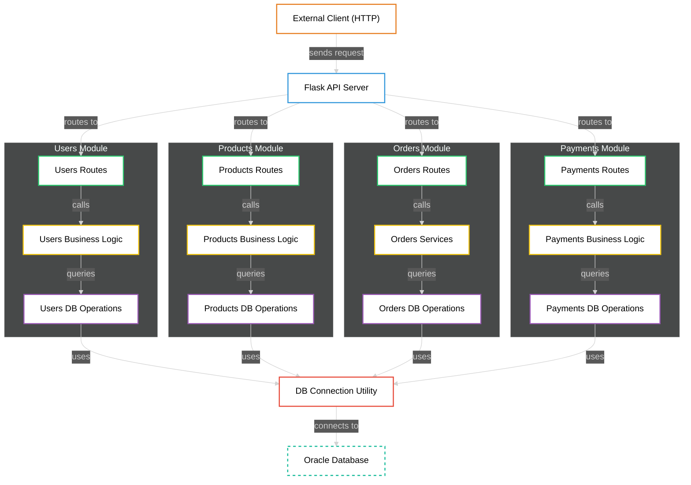

# [SBD1]P1_202100106

Este proyecto implementa una **API RESTful** en **Python (Flask)** conectada a **Oracle Database**, para gestionar un sistema completo de compras: **usuarios**, **productos**, **órdenes**, **pagos**, **envíos**, y más.  

---

## Tabla de Contenidos

- [\[SBD1\]P1\_202100106](#sbd1p1_202100106)
  - [Tabla de Contenidos](#tabla-de-contenidos)
  - [Funcionalidades Principales](#funcionalidades-principales)
  - [Estructura del Proyecto](#estructura-del-proyecto)
  - [Tecnologías](#tecnologías)
  - [Documentación](#documentación)
  - [Cómo Ejecutar el Proyecto](#cómo-ejecutar-el-proyecto)
  - [Diagrama (Generado por GitDiagram)](#diagrama-generado-por-gitdiagram)

---

## Funcionalidades Principales

- Gestión de **Usuarios** (Registro, Login, CRUD, Dirección).
- Gestión de **Productos** (Alta, Baja, Stock, Categorías).
- Gestión de **Órdenes de Compra** (Creación, Listado, Detalle).
- Gestión de **Pagos** (Asociación de métodos de pago, registro de pagos).
- Gestión de **Envíos** (Integración de empresas de transporte y estados de envío).

---

## Estructura del Proyecto

```plaintext
/client
└── /app
    ├── /users
    │   ├── __init__.py         # Inicialización del módulo users
    │   └── routes.py           # Endpoints HTTP para usuarios
    │
    ├── /products
    │   ├── __init__.py         # Inicialización del módulo products
    │   └── routes.py           # Endpoints HTTP para productos
    │
    ├── /orders
    │   ├── __init__.py         # Inicialización del módulo orders
    │   ├── routes.py           # Endpoints HTTP para órdenes
    │   ├── services.py         # Lógica de negocio y validaciones para órdenes
    │   └── db_operations.py    # Consultas SQL y manipulación de la base de datos de órdenes
    │
    ├── /payments
    │   ├── __init__.py         # Inicialización del módulo payments
    │   └── routes.py           # Endpoints HTTP para pagos
    │
    └── __init__.py             # Función create_app() y registro de blueprints de los módulos
  
│
├── utils/                # Funciones auxiliares
│   └── db.py             # Conexión a la base de datos Oracle
  └── .env              
│
├── run.py                # Punto de entrada principal para ejecutar la app
└── .venv/                # Entorno virtual 


```

---

## Tecnologías

- **Python 3.12**
- **Flask 3.1.0**
- **Oracle Database 21c**
- **cx_Oracle / oracledb**
- **bcrypt** para hashing de contraseñas
- **Docker** (opcional para levantar Oracle)

---

## Documentación

Accede a los diferentes manuales del proyecto:

- [Análisis de Datos](https://www.notion.so/An-lisis-Previo-19bfad1ba0758091b7b4d2c78529e5a0?pvs=4)
- [Manual Técnico](https://www.notion.so/Manual-T-cnico-1b4fad1ba075804aa987cb79fea0e1cc?pvs=4)
- [Manual de Usuario](https://www.notion.so/Manual-de-Usuario-1b5fad1ba07580a78603cc5652476437?pvs=21)

---

## Cómo Ejecutar el Proyecto

1. Clona el repositorio:

    ```bash
    git clone https://github.com/tuusuario/tu-repositorio.git
    ```

2. Activa el entorno virtual:

    ```bash
    source .venv/bin/activate
    ```

3. Instala las dependencias:

    ```bash
    pip install -r requirements.txt
    ```

4. Configura el archivo `.env` en `/utils`:

    ```plaintext
    DB_USER=system
    DB_PASSWORD=tuPassword
    DB_DSN=localhost:1521/XEPDB1
    
    ```

5. Corre el servidor Flask:

    ```bash
    python run.py
    ```

## Diagrama (Generado por GitDiagram)



---
